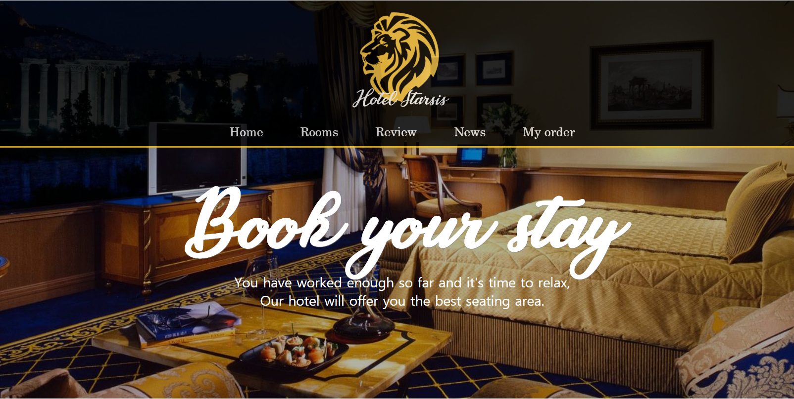

# 호텔 웹 페이지
호텔 예약 시스템을 구현한 홈페이지를 제작한 포트폴리오 입니다.

## 링크 주소
테스트를 위한 링크 주소는 [여기](http://hotelstarsis.cafe24app.com)를 클릭해주세요.

## 사용 기술
* HTML, CSS, JavaScript
* NodeJs, Express, EJS, Mysql, sanitize-Html

## 구현 기능
* 호텔 예약, 조회 기능 구현
  * 해당 기간에 예약 가능한 방을 체크하여 목록으로 출력
  * 선택한 방을 일정 시간 선점하여 다른 사람이 예약하지 못하게 설정
  * 조회 시 예약 번호와 비밀 번호로 예약 정보 조회
* 게시판 형식의 리뷰, 뉴스 Page 구현
  * Mysql DB와 연동하여 HTML의 form 태그를 활용한 Data 입출력 구현
  * Sanitize-HTML 사용으로 리뷰 작성시 잘못된 데이터 입력 방지
  * 뉴스 검색 기능, 뉴스 카테고리 기능 구현
* Transition 속성을 활용한 이미지 슬라이드 기능 및 메뉴 애니메이션 구현
  * 메뉴 상단바, Main Page 이미지 슬라이드 부분, Review Page 리뷰 작성 아이콘, News Page 뉴스 리스트 등
* 스니펫을 통한 코드 분산화
  * header, nav, main, footer를 각각 다른 문서로 분류하여 중복되는 코드를 줄임
* 미디어 쿼리 및 vw 단위 속성을 사용하여 반응형 웹 구현
  * PC, 태블릿, 휴대폰 해상도 대응
* 싱글턴 패턴을 통한 인스턴스 재사용으로 서버와 DB 사이의 connection 최적화
  * CONNECTION_LOST, TOO_MANY_CONNECTION 에러 대응

## 기능 설명
### 호텔 예약, 조회 기능
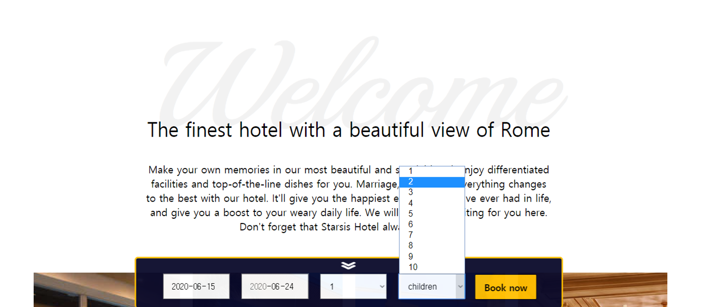
- Date 객체를 이용하여 입실 날짜는 금일 포함 그 이후로만 설정 가능하게 하였고, 퇴실 날짜는 입실 날짜 + 1달까지만 설정 가능하게 했다.
- ios환경에서는 다른 환경과 로직이 다르기 때문에 위의 조건을 성립하지 않은 날짜를 선택했을 시 오류 메세지가 뜨도록 설정했다.

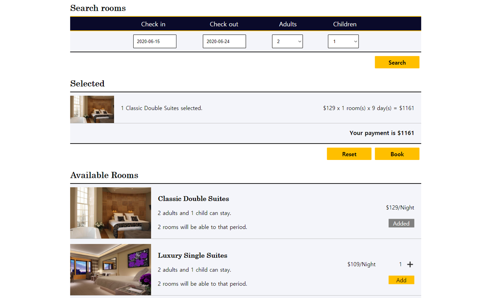
- 현재 예약된 목록을 담은 테이블이 있고 여기에 입실 날짜, 종료 날짜를 조건으로 한 쿼리를 전송하여 해당 날짜에 예약할 수 있는 방이 있는지 확인한다.  
- Selected(장바구니)에 방을 담고 빼는 과정은 javascript로 해당 태그의 innerHTML 속성을 더하고 빼는 방식으로 구현했다.
- book 버튼을 누르면 예약한 방들이 테이블에 insert되고, 테이블에 등록된 상태이므로 다른 사람들이 해당 방을 예약하지 못하게 설정했다.
- 또한 book버튼을 누르는 순간 setTimeout() 함수를 이용하여 일정 시간 동안 예약을 완료하지 못하면 자동으로 예약이 취소되게 설정했다.

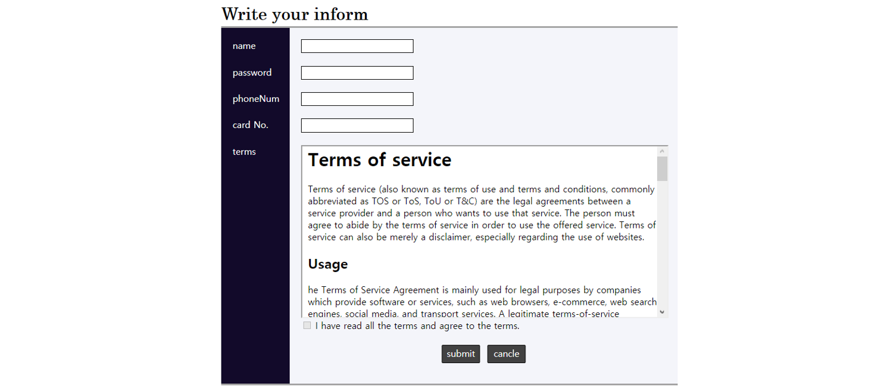
- 휴대폰 번호와 카드 번호는 정규식을 이용하여 사용자가 제대로 정보를 입력했는지 유효성 검사를 하도록 설정했다.
- 약관은 iframe 태그를 이용하여 구현하였으며 iframe 속 body 태그의 clientHeight값과 브라우저의 innerHeight값을 계산식에 넣어 스크롤이 바닥에 닿아야 약관에 동의할 수 있도록 설정했다.

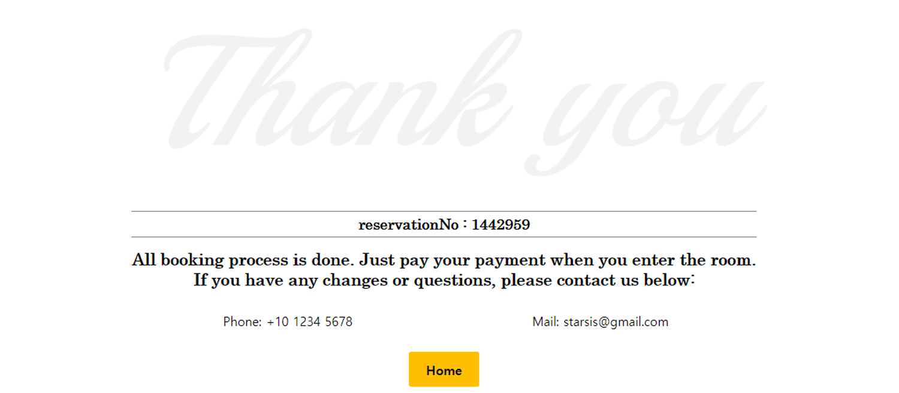
- 예약이 완료되면 테이블에 등록한 방 정보에 이전 Page에서 입력한 사용자 정보가 추가적으로 update된다.
- 예약번호는 Math.rand()함수를 사용한 7자리의 랜덤한 번호이며, 테이블에 등록된 모든 방의 예약번호와 중복되는지 검사 후 중복되지 않는 번호가 발급된다.

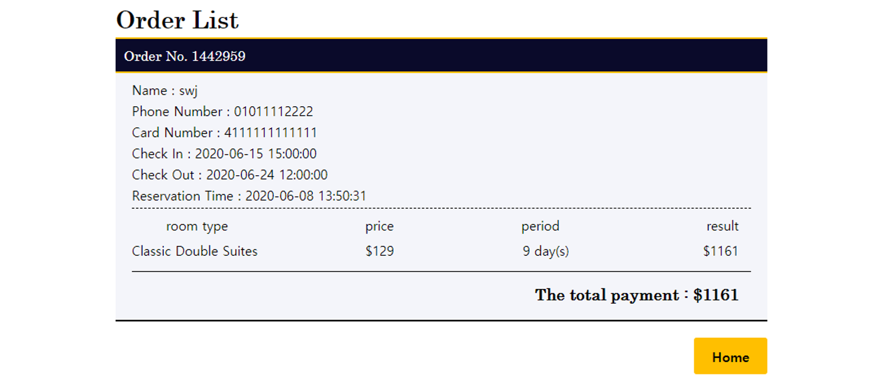
- 발급받은 예약번호와 이전 Page에서 입력한 비밀번호를 이용하여 My Order Page에서 예약한 방 목록을 볼 수 있다.
- 조회 기능은 DB에 예약번호와 비밀번호를 조건으로 한 쿼리를 보내서 해당 내용과 일치하는 예약 내역을 출력하는 방식으로 구현했다.

### 리뷰, 뉴스 Page 구현
- 리뷰와 뉴스 Page는 Mysql을 이용하여 DB에 저장된 데이터를 내림차순 형식으로 정렬하여, 요청한 Page 숫자에 해당하는 id를 가진 데이터 목록만 출력하는 방식으로 구현했다.

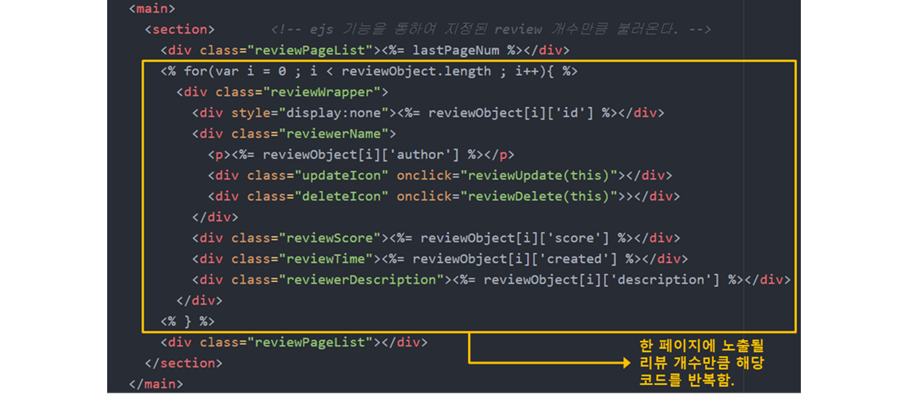
- 리뷰나 뉴스 Page는 한 Page에 노출되는 게시물 숫자만큼 동일한 태그가 여러번 나열되는 구조이므로, 코드 작성량을 줄이기 위해 ejs를 활용하였다.

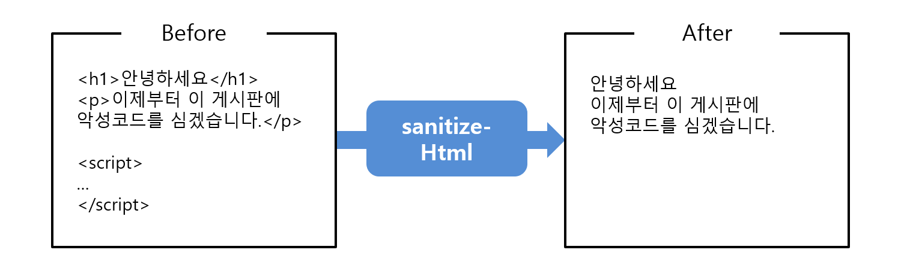
- 리뷰 게시판은 글 작성, 수정, 삭제를 모두 지원한다. 따라서 리뷰 게시판에서는 사용자가 직간접적으로 DB에 관여하게 된다.
- 이러한 이유로 악의적인 목적을 가지고 description 등에 코드를 심을 수도 있으므로, sanitize-Html을 이용하여 사용자가 입력한 내용을 필터링한다.
- 뉴스의 검색 기능이나 카테고리 기능은 사용자가 입력한 검색어나 카테고리 명을 조건으로 하는 쿼리를 사용해서 구현하였다.
- 뉴스의 검색 기능에도 게시판과 마찬가지로 sanitize-Html을 이용한 필터링이 적용되었다.

### 이미지 슬라이드 및 메뉴 애니메이션 구현
- 프레임워크 없이 CSS transition 속성과 javascript만을 활용하여 슬라이드를 제작했다.

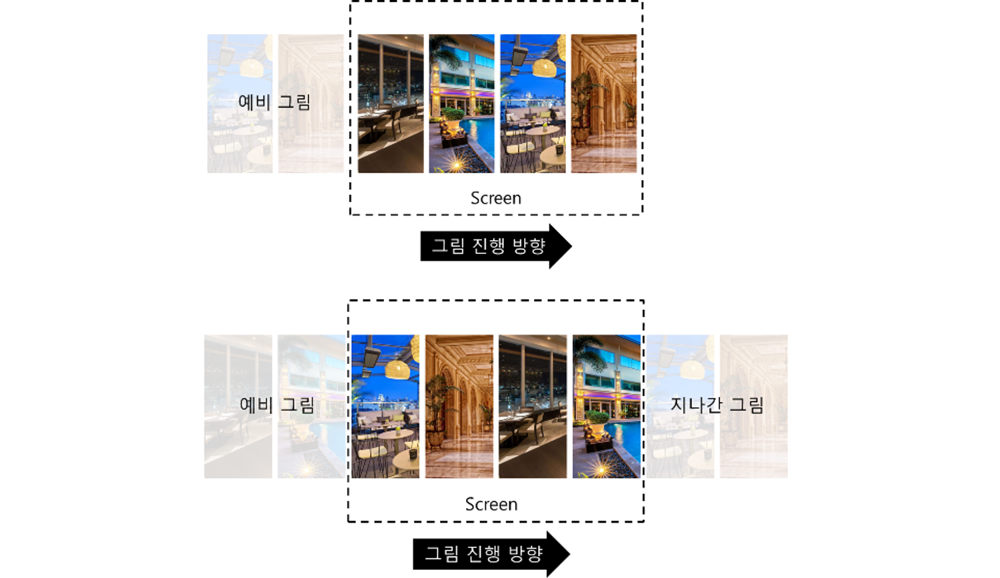
- 예비 그림 4장을 준비한 후 transition 속성을 left로 주고, setTimeOut() 함수를 이용하여 left 속성을 일정 시간마다 변경하면 사용자 입장에선 그림이 자연스럽게 slide되는 것처럼 보인다.

- 예비 그림 4장이 모두 screen에 비춰지면 transition-duration 속성을 0초로 주고, left를 원래 위치로 돌려놓는다.
- 그림의 위치들은 처음 위치로 초기화되지만 시각적으로는 변화가 없으므로 사용자 입장에서는 그림이 loop하는 것처럼 보여진다.
- 기타 다른 애니메이션들도 CSS transition 속성을 이용하여 구현했다.

### 코드 분산화(스니펫)
- 기존의 코드를 부분 별로 분산화하여 필요한 부분만 유지보수가 가능하게 하며, 중복되는 부분을 제거하여 전체적인 코드 수를 줄이는 것이 목적이다.

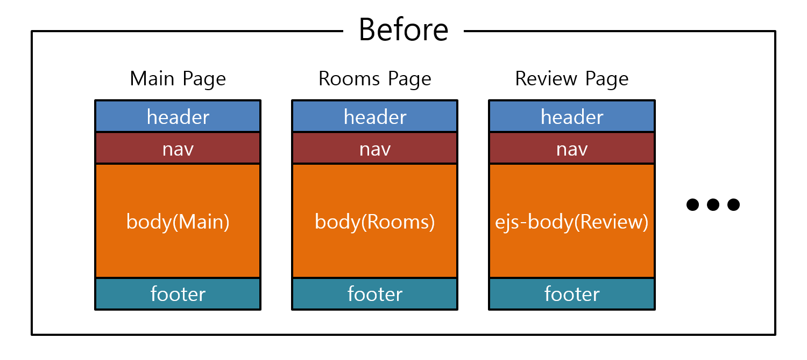
- 이 웹페이지는 각 Page마다 header, nav, body, footer의 구조로 되어있다.
- header, nav, footer 부분은 body 부분과 달리 모든 페이지에서 공통적으로 사용되는 코드이므로, 새 페이지를 작성할 때마다 해당 부분의 코드를 반복해야 하는 문제점이 있었다.

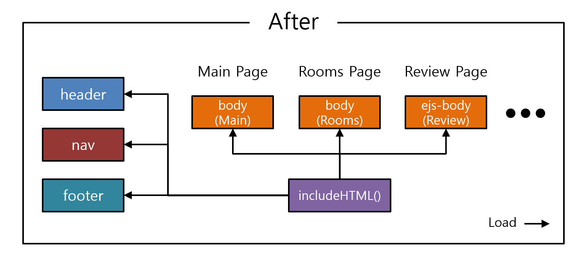
- header, nav, footer 부분 등을 따로 파일로 분류하고, 각각의 Page에 대응하는 javascript 파일의 includeHTML() 함수로 파일 별로 저장되어 있던 코드들을 불러오게끔 설정하여 코드 스니펫을 구현했다.

### 반응형 웹 구현
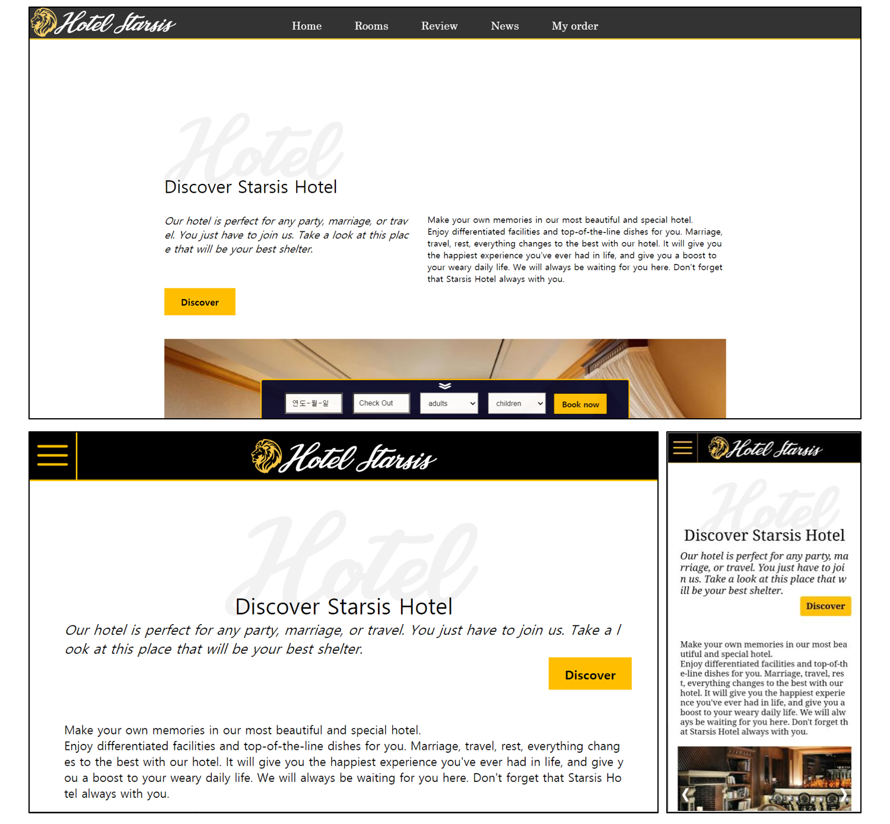
- 미디어 쿼리를 사용하여 css 속성을 화면의 현재 가로 크기를 기준으로 크게 3단계(1024px 이상, 640px 이상, 640px 미만)로 분류했다.
- 각각의 사이즈는 PC화면, 태블릿 화면, 휴대폰 화면 크기에 대응을 하며 단위를 px가 아닌 vw를 사용하여 화면 크기에 따라 UI의 위치나 크기가 알맞게 변경되도록 설정했다.

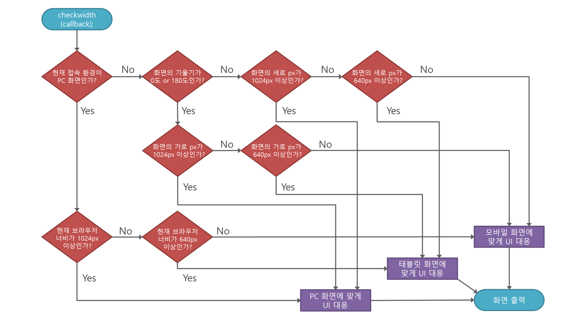
- 사용자가 웹 페이지 접속 시 스크린의 가로 크기를 header.js에 있는 checkwidth() 함수에서 검사한다.
- navigator.userAgent 속성을 활용하여 현재 웹 접속 환경이 PC인지 아닌지 체크한다.
- PC 환경이라면 웹 브라우저의 가로 px에 맞는 UI를 구성하여 화면을 출력해준다. 또한, onResize() 함수로 창의 크기가 변하면 이를 감지하고 UI를 새로 구성한다.
- PC 환경이 아니라면 기기의 기울기(가로, 세로)를 검사 후 해당 기울기에 맞게 가로 px(화면이 기울어져 있으면 세로px)를 구하여 UI 크기를 조절한다.

### 싱글턴 패턴을 이용한 connection 인스턴스 재사용
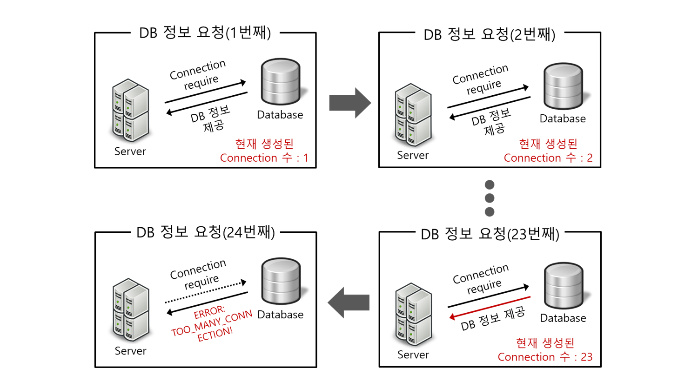
- 서버에서 DB 정보를 받아와야 할 때, 기존에는 연결 요청 때마다 새로운 connection 인스턴스를 생성하는 방식을 사용했었다.
- 사용자가 몰리거나 한 사용자가 페이지 전환을 무한정으로 반복 실행하게 되면 DB측에서 TOO_MANY_CONNECTION 에러가 발생하는 문제점이 생겼다.
- 문제점 해결을 위해 사용자가 최초로 생성했던 connection 인스턴스를 계속 재활용하는 싱글턴 패턴을 도입하였다.

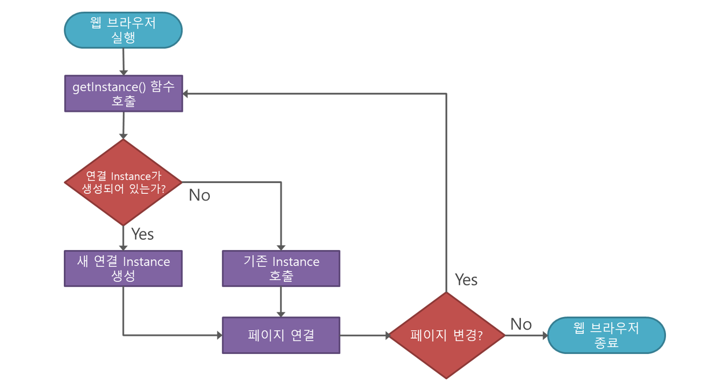
- 최초로 연결된 connection 객체에서 getInstance() 함수를 호출하면 그 안에 있던 init() 함수를 통해 파일에 담겨있던 DB 연결정보를 세팅하고 connection 인스턴스 하나를 생성한다.
- 생성된 인스턴스의 getConnection() 함수를 이용하여 서버와 DB간의 연결을 시작한다.
- 서버에서 새로 DB 정보를 요구할 시 getInstance() 함수를 호출하여 처음에 만든 connection 인스턴스를 호출하므로 서버와 DB간 연결 부하를 줄일 수 있다.
